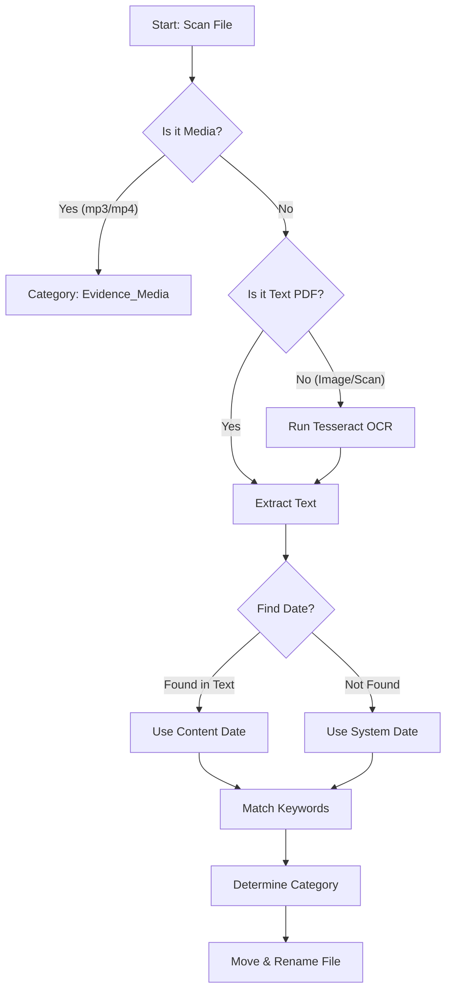

<div align="center">
  <h1>🧠 Folder Intelligence (Project Phoenix)</h1>
  <p><strong>The Universal File System Cortex for AI Agents & Power Users</strong></p>
  <p>Audit → OCR → Rename → Categorize → Document — in one powerful CLI.</p>
</div>

<div align="center">
  <a href="https://opensource.org/licenses/MIT"></a>
  <a href="https://www.python.org/downloads/"></a>
  <a href="https://github.com/psf/black"></a>
  
</div>

---

> **"Your digital life is chaos. Folder Intelligence brings order."**

---

## ⚡ Quick Start: The Universal Tool (`universal_cli.py`)

We have consolidated our 5-stage pipeline into a **Single Universal Tool** that works on *any* directory.

### 1. Install
```bash
git clone https://github.com/SGajjar24/folder-intelligence.git
cd folder-intelligence
pip install -r requirements.txt
# Ensure Tesseract OCR is installed on your system!
```

### 2. Run (Safe Mode)
By default, it runs in **Dry Run** mode. It scans, OCRs, and *proposes* changes without touching files.

```bash
python universal_cli.py "C:\Users\You\Downloads"
```

### 3. Execute
Satisfied with the plan? Apply the changes:

```bash
python universal_cli.py "C:\Users\You\Downloads" --execute
```

---

## 📊 How It Works (The Logic Flow)

Unlike simple organizers, we don't just look at filenames. We look *inside* files.



---

## 🏆 Why Folder Intelligence?

| Feature | Folder Intelligence | Others |
|---|:---:|:---:|
| **Universal** | ✅ Works on any folder | ❌ Specific folders only |
| **OCR Powered** | ✅ Reads Scanned PDFs/Images | ❌ Filename only |
| **Safety First** | ✅ Dry Run by Default | ⚠️ Instant usage |
| **Configurable** | ✅ External JSON Rules | ❌ Hardcoded |
| **Enterprise Standard** | ✅ SOP & ISO 8601 | ❌ Random naming |

---

## ⚙️ Configuration (`default_config.json`)

Customize the logic to fit your needs (e.g., Music, Work, Legal). The tool loads `default_config.json` by default, but you can pass any config file with `--config`.

```json
{
    "categories": {
        "01_Bills": ["invoice", "receipt", "paid"],
        "02_Contracts": ["agreement", "signed", "nda"],
        "99_Unsorted": []
    },
    "blocked_dirs": ["C:\\Windows", "C:\\Program Files"]
}
```

```bash
python universal_cli.py "C:\My\Music" --config "music_config.json"
```

---

## 📜 Enterprise SOP (Standard Operating Procedures)

This project ships with formal governance documentation:

| Rule | Description |
|---|---|
| **Zero-Clutter Policy** | No folder shall contain >10 loose files |
| **ISO 8601 Naming** | `YYYY-MM-DD` is the only acceptable date format |
| **Hash-Based Truth** | Never delete based on name alone — verify SHA-256 |
| **Self-Documentation** | Every directory must contain a `README.md` |

See [`SOP.md`](SOP.md) for full enterprise use cases.

---

## ✍️ Author

**Swetang Gajjar**

[](https://www.linkedin.com/in/gajjarswetang/)
[](mailto:gajjarswetang@gmail.com)

---

## 📄 License

This project is licensed under the MIT License — see [`LICENSE`](LICENSE) for details.

<p align="center">
  <strong>⭐ If this tool saved you time, give it a star!</strong><br>
  <em>Built with precision. Ships with governance.</em>
</p>
