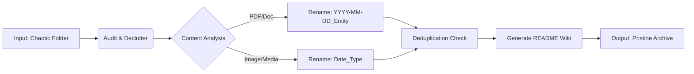

<div align="center">
  <h1>🧠 Folder Intelligence</h1>
  <p><strong>The File System Cortex for AI Agents</strong></p>
  <p>Audit → Declutter → Rename → Deduplicate → Document — in one toolkit.</p>
</div>

<div align="center">
  <a href="https://opensource.org/licenses/MIT"></a>
  <a href="https://www.python.org/downloads/"></a>
  <a href="https://github.com/psf/black"></a>
  <a href="http://makeapullrequest.com"></a>
  
</div>

---

> **"Your AI Agent is blind. Folder Intelligence gives it sight."**

---

## ⚡ How It Works

**Before:**
```
D:/Company_Archive/
├── Scan0001.pdf
├── budget_final_FINAL_v3.xlsx
├── IMG_20231015.jpg
├── meeting notes oct.docx
├── Scan0001 (1).pdf          ← duplicate
├── NDA_acme_signed.pdf
├── random.txt
├── invoice_sept.pdf
├── Q3_report_draft.pptx
├── old_budget.xlsx
└── receipt_lunch.jpg

0 directories, 11 files
```

**After:**
```
D:/Company_Archive/
├── README.md                                    ← auto-generated index
├── Contracts/
│   ├── README.md
│   └── 2023-10-15_Contract_Acme_Corp_NDA.pdf
├── Financial/
│   ├── README.md
│   ├── 2023-09-01_Invoice_September.pdf
│   └── 2023-10-15_Receipt_Lunch.jpg
├── Reports/
│   ├── README.md
│   └── 2023-10-01_Report_Q3_Draft.pptx
└── Archive/
    └── 2023-01-01_Unknown_Scan0001_1.pdf        ← de-duped & archived
```

---

## 🆚 Why Folder Intelligence?

| Feature | Windows Explorer / Finder | AI Tools (ChatGPT) | **Folder Intelligence** |
| :--- | :---: | :---: | :---: |
| **Logic** | Manual | "AI Guesswork" | **Deterministic Rules + content scraping** |
| **Privacy** | High | **Uploads to Cloud ⚠️** | **100% Local (Air-Gapped Safe)** |
| **Deduplication** | None | None | **SHA-256 Forensic Hash** |
| **Speed** | Slow | Slow (API Latency) | **blazing Fast (Milliseconds)** |
| **Cost** | Free | $20/month | **Free & Open Source** |

---

## 🛠️ The Pipeline



---

## 🚀 Quick Start

### Prerequisites
- Python 3.9+
- `pip install -r requirements.txt`

### 1. Audit (Safe Mode)
Passively scan the folder and generate a `clutter_report.json`.
```bash
python universal_intelligence.py --target "D:/My_Files"
```

### 2. Declutter & Organize
Move loose files into categories based on `config.py`.
```bash
python universal_declutter.py --target "D:/My_Files" --execute
```

### 3. Smart Rename
Rename files based on content (Date, Entity, Type).
```bash
python universal_namer.py --target "D:/My_Files" --execute
```

### 4. Deduplicate
Remove exact binary duplicates (SHA-256).
```bash
python universal_dedupe.py --target "D:/My_Files" --delete
```

---

## 🏗️ Project Structure

```
├── universal_intelligence.py   # The "Brain" (Audit & README gen)
├── universal_declutter.py      # The "Hands" (Moves files)
├── universal_namer.py          # The "Eyes" (Reads content)
├── universal_dedupe.py         # The "Judge" (Deletes duplicates)
├── config.py                   # Configuration (Keywords, Entities)
├── SOP.md                      # Standard Operating Procedures
├── SKILL.md                    # Agentic Skill Definition
└── README.md                   # You are here
```

---

## 🔒 Enterprise & Security

We take security seriously. 
- **Zero Cloud:** No data leaves your machine.
- **Forensic Logs:** All actions are logged.
- **Vulnerability Reporting:** See [`SECURITY.md`](SECURITY.md).

For enterprise support, please see [CONTRIBUTING.md](CONTRIBUTING.md).

---

## ✍️ Author

**Swetang Gajjar**

[](https://www.linkedin.com/in/gajjarswetang/)
[](mailto:gajjarswetang@gmail.com)

---

## 🔮 Future Scope

This project is actively evolving. Here's what has been shipped and what's on the horizon:

**✅ Shipped:**
- Content-aware PDF renaming (Regex + PyMuPDF)
- SHA-256 forensic deduplication
- Auto-generated per-folder README documentation
- Enterprise SOP and governance framework
- Configurable keyword/entity engine
- Dry-run mode for all operations

**🔜 Future Enhancements (Under Exploration):**
- GUI dashboard for non-technical users
- OCR support for scanned image documents
- Undo/rollback system with rename logging
- Watch mode (auto-organize new files in real-time)
- Docker container for server-side deployment
- Plugin architecture for custom classification rules
- Multi-language content analysis
- Cloud storage integration (S3, GCS, Azure Blob)

> 💡 **Interested in contributing or enhancing this project?** I'm actively working on the future scope and would love to hear your thoughts — feel free to [open an issue](../../issues) or reach out via [LinkedIn](https://www.linkedin.com/in/gajjarswetang/) or [Email](mailto:gajjarswetang@gmail.com).

