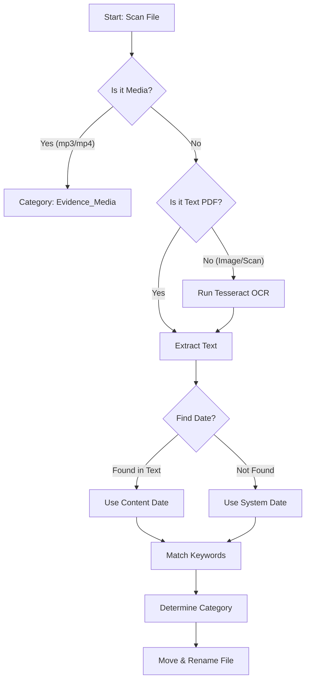

# Universal Folder Organizer (Project Phoenix)

**Repository:** [SGajjar24/folder-intelligence](https://github.com/SGajjar24/folder-intelligence)

A powerful, **Local AI-driven** CLI tool to organize chaotic folders into structured archives.

## 🚀 Features
*   **Universal:** Works on any directory you point it to.
*   **Smart:** Uses **OCR (Tesseract)** to read scanned PDFs and images.
*   **Safe:** Always runs in **Dry Run** mode first. Requires explicit confirmation to move files.
*   **Configurable:** Define your own categories and keywords in `default_config.json`.

## 📊 How It Works (The Logic Flow)


## 📦 Installation
1.  **Requirements:**
    *   Python 3.8+
    *   `pip install pymupdf pytesseract pillow`
    *   Tesseract OCR installed (and in PATH or standard location).

## 🛠️ Usage

### 1. The Safety Check (Dry Run)
By default, the tool only *simulates* the organization to show you what it WOULD do.

```bash
python universal_cli.py "C:\Users\You\Downloads"
```

### 2. The Execution (Live)
Once you are happy with the plan, run with `--execute`.

```bash
python universal_cli.py "C:\Users\You\Downloads" --execute
```

### 3. Custom Rules
Want to organize your **Music** or **Work Projects**?
1.  Copy `default_config.json` to `my_music_rules.json`.
2.  Edit the categories (e.g., "Rock", "Jazz").
3.  Run:
```bash
python universal_cli.py "C:\My\Music" --config "my_music_rules.json"
```

## ⚙️ Configuration Format (`json`)
```json
{
    "categories": {
        "01_Bills": ["invoice", "receipt", "paid"],
        "02_Contracts": ["agreement", "signed", "nda"],
        "99_Unsorted": []
    },
    "blocked_dirs": ["C:\\Windows"]
}
```

## ⚠️ Safety Mechanisms
1.  **Blocked Directories:** Prevents accidental running on System folders (`C:\Windows`).
2.  **Name Collision:** If a file exists, it auto-renames (`_1`, `_2`) instead of overwriting.
3.  **Confirmation:** Prompts `Are you sure? (y/n)` before execution.
